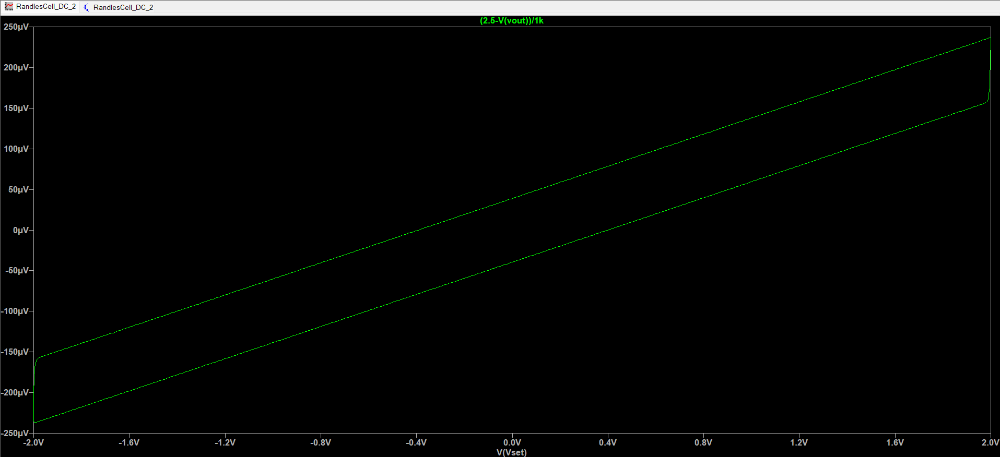
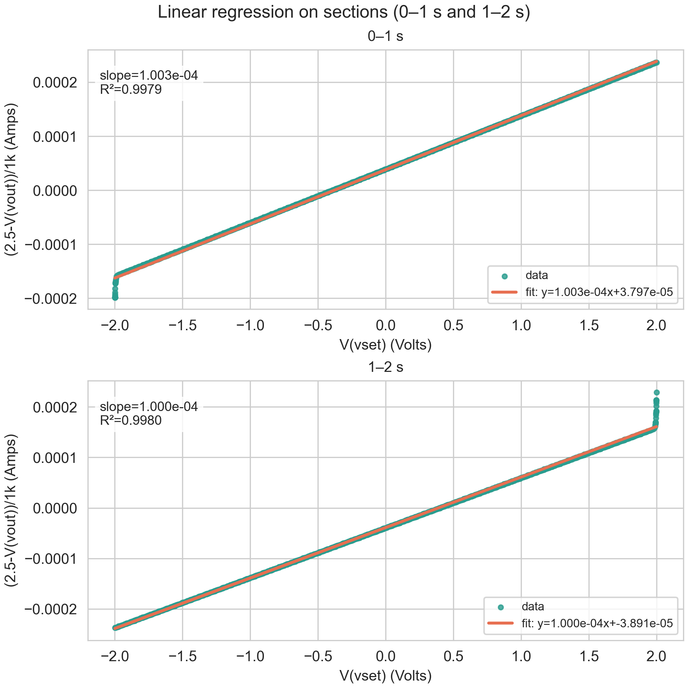

# Simulation Notes - Open Source Potentiostat

This document outlines the circuit simulations done during the design process. All simulations were done using LTspice, an open source SPICE simulation software. Simulation files can be found in the `simulations/` folder of this repository.

---

# 1. DAC Offset Circuit

**Purpose**
Verify that the difference amplifier correctly scales and shifts the MCP4725 unipolar output (0–3.3V) to the required bipolar range (±2V), confirming the resistor values R1 = 8.25 kΩ, R2 = 10 kΩ, R3 = 10 kΩ, R4 = 12.1 kΩ produce the correct output.

## 1.1 DC Operating Point

Expected results are calculated as follows:

```
Vout = (R4/R2) × (Vin - Vref)
Vout = (12.1k/10k) × (Vin - 1.65)
Vout = 1.21 × (Vin - 1.65)
```

**Test 1: Minimum input (Vin = 0V)**

Calculation: Vout = 1.22 × (0 - 1.65) = **-2.0V**

| Node | Expected | Simulated | Pass/Fail |
|------|----------|-----------|-----------|
| Vref | 1.65V | 1.64996V | Pass |
| Vout | -2.0V | -1.9997V | Pass |

Simulation file: `DAC_Offset_DC_PNT_1`

---

**Test 2: Midpoint input (Vin = 1.65V)**

Calculation: Vout = 1.22 × (1.65 - 1.65) = **0V**

| Node | Expected | Simulated | Pass/Fail |
|------|----------|-----------|-----------|
| Vref | 1.65V | 1.65V | Pass |
| Vout | 0V | 0.000110925V | Pass |

Simulation file: `DAC_Offset_DC_PNT_2`

---

**Test 3: Maximum input (Vin = 3.3V)**

Calculation: Vout = 1.22 × (3.3 - 1.65) = **+2.0V**

| Node | Expected | Simulated | Pass/Fail |
|------|----------|-----------|-----------|
| Vref | 1.65V | 1.64996V | Pass |
| Vout | 2V | 1.99993V | Pass |

Simulation file: `DAC_Offset_DC_PNT_3`

**Outcome**
The simulation performed as expected to an acceptable degree of error for all 3 cases, correctly offsetting and scaling the DAC output to the required ±2V bipolar range.

---

# 2. Potentiostat Control Loop

**Purpose**
Verify that the potentiostatic control circuit correctly maintains the working electrode potential equal to Vset. The control amplifier (U3) compares Vset against the buffered reference electrode potential from the reference buffer (U2) and drives the counter electrode (CE) to eliminate any error. The error between Vset and V(RE) should be negligible at steady state.

## 2.1 DC Operating Point

**Expected results:**
At steady state with the feedback loop closed, the control amplifier enforces V(RE) = Vset. A resistor is used as a stand-in for a cell connected directly between CE and RE. V(RE) should equal Vset.

**Test 1: 10 kΩ resistor load**

| Node | Expected | Simulated | Pass/Fail |
|------|----------|-----------|-----------|
| Vset | 0.5V | 0.5V | Pass |
| V(CE) | 0.5V | 0.5V | Pass |
| V(RE) | 0.5V | 0.5V | Pass |

Simulation file: `Control_Loop_DC_OP_PNT_1`

---

**Test 2: 20 kΩ resistor load**

| Node | Expected | Simulated | Pass/Fail |
|------|----------|-----------|-----------|
| Vset | 0.5V | 0.5V | Pass |
| V(CE) | 0.5V | 0.5V | Pass |
| V(RE) | 0.5V | 0.5V | Pass |

Simulation file: `Control_Loop_DC_OP_PNT_2`

**Outcome**
The simulation performed as expected for both cases. The circuit correctly maintains V(RE) = Vset regardless of load resistance, confirming correct potentiostatic control loop operation.

---

## 2.2 Control Loop Tracking

**Purpose**
Ensure the counter electrode responds fast enough to keep the reference electrode at the target potential across the full CV scan rate range.

**Simulation Configuration:**
- Input: Vset set to a sine wave, DC Offset = 0V, Amplitude = 2V, Frequency = 10 Hz
- Load: resistor between CE and RE
- Command: `.tran 0 200ms`
- Probe: Vset and V(RE) on the same graph

**Expected Outcome:**
- V(RE) should perfectly overlap Vset
- V(RE) - Vset = 0 at all times
- No clipping

Simulation file: `Control_loop_Trans_1`

**Outcome**
V(RE) and Vset overlapped perfectly with a difference of zero, confirming the control loop tracks the input signal correctly with no lag or clipping at the tested frequency.

---

# 3. Transimpedance Amplifier (TIA)

**Design note:** Over the required current range, the TIA may output a negative voltage. This is an issue for the unipolar ADC so we need to shift the TIA output. This is done after the TIA by a separate summing circuit.

The TIA output voltage before the summing circuit is:

```
Vout_TIA = -(Iin × Rfeedback)
```

After the summing circuit:

```
Vout_final = 2.5 + (Iin × Rfeedback)
```

The 2.5V offset is subtracted in firmware to recover the true current value.

## 3.1 DC Operating Point

**Purpose**
Verify that the TIA correctly converts working electrode current to an output voltage, and that the summing circuit correctly applies the 2.5V offset, according to Vout = 2.5 + (Iin × Rfeedback).

Expected results calculated using: `Vout = 2.5 + (Iin × R)`, with 1 MΩ feedback resistor:

**Test 1: Iin = +2 µA**

Calculation: Vout = 2.5 + (2×10⁻⁶ × 1×10⁶) = **4.5V**

| Node | Expected | Simulated | Pass/Fail |
|------|----------|-----------|-----------|
| V(WE) | 0V | ~0V | Pass |
| Vout | 4.5V | 4.5V | Pass |

Simulation file: `TIA_DC_OP_PNT_1`

---

**Test 2: Iin = 0 µA**

Calculation: Vout = 2.5 + (0) = **2.5V**

| Node | Expected | Simulated | Pass/Fail |
|------|----------|-----------|-----------|
| V(WE) | 0V | ~0V | Pass |
| Vout | 2.5V | 2.5V | Pass |

Simulation file: `TIA_DC_OP_PNT_2`

---

**Test 3: Iin = -2 µA**

Calculation: Vout = 2.5 + (-2×10⁻⁶ × 1×10⁶) = **0.5V**

| Node | Expected | Simulated | Pass/Fail |
|------|----------|-----------|-----------|
| V(WE) | 0V | ~0V | Pass |
| Vout | 0.5V | 0.500003V | Pass |

Simulation file: `TIA_DC_OP_PNT_3`

**Outcome**
The simulation performed as expected for all 3 cases. The TIA correctly converts working electrode current to voltage and the summing circuit correctly applies the 2.5V offset, keeping the output within the ADC input range for the full expected current range.

---

## 3.2 AC Stability Analysis

**Purpose**
Ensure the TIA does not oscillate across all four feedback resistance values.

**Simulation Configuration:**
- Input: AC current source (AC = 1) through a Randles cell model (Rs = 100 Ω, Cdl = 20 µF, Rct = 10 kΩ)
- Command: `.ac dec 100 1 10Meg`
- Probe: TIA output node

**Expected Outcome:**
- Gain flat at low frequencies, rolling off smoothly at high frequencies
- Phase margin between 45° and 90° to prevent oscillation

| Test | Feedback Resistor | Compensation Capacitor | Result |
|------|------------------|----------------------|--------|
| 1 | 1 kΩ | 50 pF | Stable |
| 2 | 10 kΩ | 50 pF | Stable |
| 3 | 100 kΩ | 50 pF | Stable |
| 4 | 1 MΩ | 50 pF | Stable |

Simulation files: `TIA_AC_Stability_1K`, `TIA_AC_Stability_10K`, `TIA_AC_Stability_100K`, `TIA_AC_Stability_1M`

**Outcome**
A compensation capacitor of 50 pF across the feedback resistor ensures TIA stability for all four feedback resistance values. The C1 value in the schematic was updated to 50 pF.

---

## 3.3 Transient Step Response

**Purpose**
Observe how the TIA handles sudden changes in input current and confirm no ringing or instability with the selected compensation capacitor.

**Simulation Configuration:**
- Input: PULSE current source. Parameters: Initial = 0, Pulse = 1 µA, Delay = 1 ms, Rise = 1 ns, Fall = 1 ns, Width = 10 ms, Period = 20 ms
- Command: `.tran 0 50ms 0 10u`
- Probe: TIA output node

**Expected Outcome:**
- When current steps from 0 to 1 µA, Vout should step from 2.5V to 3.5V (2.5V offset + 1 µA × 1 MΩ = 1V swing)
- Signal should settle cleanly with no ringing

| Test | Feedback Resistor | Result |
|------|------------------|--------|
| 1 | 1 kΩ | Pass |
| 2 | 10 kΩ | Pass |
| 3 | 100 kΩ | Pass |
| 4 | 1 MΩ | Pass |

Simulation files: `TIA_Step_1K`, `TIA_Step_10K`, `TIA_Step_100K`, `TIA_Step_1M`

---

## 4. Full-Circuit Randles Cell Simulation

**Purpose**
Verify the complete signal chain with a Randles cell equivalent circuit and confirm that the resulting current-vs-potential response matches the behavior theoretically expected from the Randles cell.

**Simulation Configuration:**

- Randles cell placed between CE and RE/WE: Rs = 100 Ω, Rct = 10 kΩ, Cdl = 10 µF 
- TIA feedback resistor: 1 kΩ
- Input: DAC output/Vin is a PWL sweep, 0V → 3.3V over 1s then 3.3V → 0V over the following 1s
- Command: `.tran 2`
- Probe: V(vset) on the x-axis, (2.5-V(vout))/1k on the y-axis

**Expected Outcome:**

- Since Vset = 1.21 x (Vin - 1.65), the 3.3V/s ramp on Vin produces a Vset scan rate of ≈4.0 V/s
- The response should be dominated by the resistive path in the Randles cell (Rs + Rct), giving a straight line I vs Vset realationshipso with a slope of 1/10.1 kΩ
- The forward and reverse sweep traces should separate into a hysteresis loop, from Cdl charging/discharging (icap = Cdl × dVset/dt)

Calculations, using Vset = ±2V and scan rate = 4.0V/s:

Resistive term (steady-state, Cdl fully charged):
I_R = Vset / (Rs + Rct) = Vset / 10.1kΩ  →  at Vset = 2V: I_R ≈ 198 µA

Capacitive term (icap = Cdl × dVset/dt):
I_C = 10µF × 4.0V/s = 40 µA

Predicted full loop separation: ΔI = 2 × I_C = 80 µA
Predicted forward-branch current at Vset = +2V: I_R + I_C ≈ 238 µA
Predicted reverse-branch current at Vset = +2V: I_R − I_C ≈ 158 µA

| Parameter | Expected Value | 
|------|------------------|
| Total Loop Separation | 80 uA |
| Linear Regression Slope | 9.901e-5 S ~= 99.01 uA/V |
| Forward Y-Intercept | +40 uA |
| Reverse Y-Intercept | -40 uA|

**Results:**

LTSpice simulation plot:



Linear regression of forward and reverse sweep traces:



Results show a clear hysteresis loop, and linear regression yields a slope within 1% of target ($R^2 \ge 0.998$, $I_{cap} \approx \pm 40\ \mu\text{A}$) with exact theoretical alignment once edge $RC$ transients are trimmed. This confirms the circuit behaves as intended

